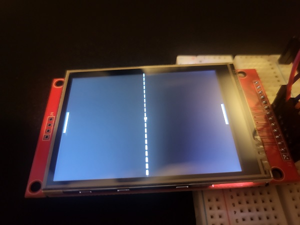

# MicroPong (NUCLEO-F446RE + ILI9341, SPI)

Bare-metal Pong prototype on **NUCLEO-F446RE** with an **ILI9341 (240×320)** TFT over **SPI**.  
All **GPIO**, **SPI**, and **ILI9341** drivers are custom and written from scratch (no HAL/CMSIS).

---

## Hardware
- **MCU Board:** NUCLEO-F446RE (STM32F446RE)
- **Display:** ILI9341 TFT (240×320), SPI interface
- **Interface Lines:** SCK, MOSI, (optional MISO), CS, DC, RST, +3V3, GND

> Orientation currently set to 90° (landscape). Adjust in display config if needed.

---

## Demo



---

## Current Status
- **Game mode:** CPU vs. CPU (only)
- **Rendering:** Working; paddles/ball draw and update
- **Scoring:** **Not implemented**
- **Known issue:** **Paddle flicker/blink** during motion

---

## Build & Flash
Requirements: `gcc-arm-none-eabi`, `make`, `STM32_Programmer_CLI`

```bash
# Clone
git clone --recursive https://github.com/cambatch/MicroPong.git
cd MicroPong/firmware

# Build
make

# Flash
make flash
# or use your preferred flashing tool/command
